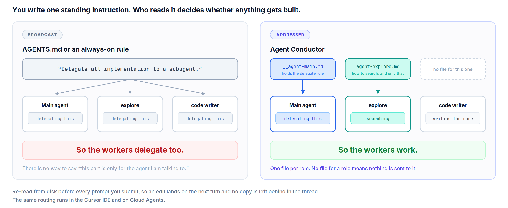
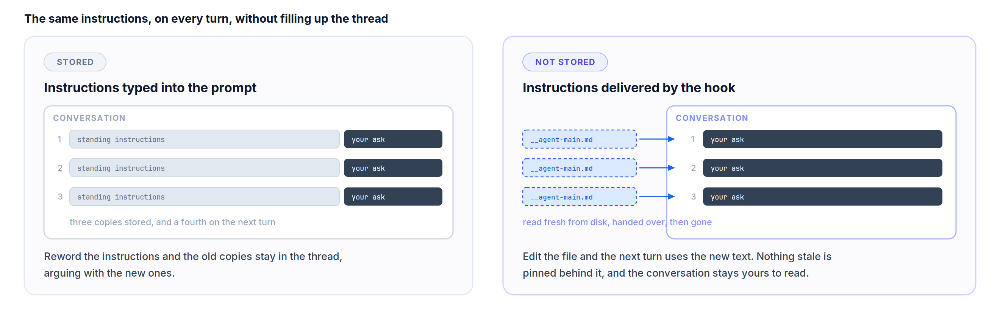

# Agent Conductor

**Standing instructions for one Cursor agent, not for all of them.**

Cursor has two places for instructions that apply on every turn. A rule with `alwaysApply`, or an `AGENTS.md`. Both go to every agent in the workspace. The agent you are talking to reads them. So does every subagent it spawns.

That breaks as soon as you use subagents. Write "delegate implementation to a subagent, never write code in this thread" and your workers read it too, so they delegate instead of working. Write "you are the orchestrator" and five agents believe it at once.

Agent Conductor gives each role its own file.



| File | Who reads it | When it arrives |
| --- | --- | --- |
| `__agent-main.md` | the agent you are chatting with, and nothing else | before every prompt you submit |
| `agent-explore.md` | subagents of type `explore` | when the agent spawns one |
| `agent-{subagent_type}.md` | subagents of that exact type | when the agent spawns one |

No file for a role means nothing is sent to that role. The `agent-` prefix is fixed and the suffix is the subagent type verbatim, so `explore` needs `agent-explore.md`.

## The main agent's copy never lands in the thread

`__agent-main.md` is read from disk on each submission and handed over as hook context rather than as a message. So it does not pile up turn after turn, and nothing stale sits behind the current copy.



Edit the file and the next prompt uses the new text. That is the part people notice first. You can rework the orchestrator's instructions in the middle of a conversation without restarting the chat or scrolling past six copies of your own boilerplate.

## Install

The plugin needs `jq` and `python3` on `PATH`.

**From this repo, locally.** Clone it and link the plugin into Cursor's local plugin directory, then run **Developer: Reload Window**.

```bash
git clone https://github.com/dev2o/dev2o-plugins.git
ln -s "$PWD/dev2o-plugins/plugins/agent-conductor" ~/.cursor/plugins/local/agent-conductor
```

**As a team marketplace.** Open **Dashboard -> Plugins**, click **Add Marketplace**, choose **Import from Repo**, and give it `https://github.com/dev2o/dev2o-plugins`. Teammates then install Agent Conductor from **Customize**.

Cloud Agents need one extra step, because Cursor loads cloud hooks only from the project's own `.cursor/hooks.json`. See [Cloud Agents](docs/cloud-agents.md).

## Write your first orchestrator prompt

The plugin ships a default `__agent-main.md`. Override it in your project, per file, without forking anything.

1. Create the override and put a line in it you will recognize.

   ```bash
   mkdir -p .cursor/dev2o-agent-conductor/config
   cat > .cursor/dev2o-agent-conductor/config/__agent-main.md <<'MD'
   <orchestrator_rules>
   - Delegate every implementation task to a subagent. Do not edit files in this thread.
   - Codename for this project is BLUE HERON.
   </orchestrator_rules>
   MD
   ```

2. Open a new chat and send any prompt.

3. Ask the agent for the codename. It answers BLUE HERON, because the hook handed it the file.

4. Spawn a subagent and ask it the same question. It has never heard of BLUE HERON, and it edits files instead of delegating.

5. Read what the hook decided, one line per prompt.

   ```bash
   cat /tmp/cursor-hook-debug/registry/inject-decisions.log
   ```

   ```text
   2026-08-21T17:40:04Z cid=bc-09cb2003-...  decision=inject reason=main agent
   2026-08-21T17:49:05Z cid=bc-88f10553-...  decision=skip   reason=prompt matches a recorded spawn
   ```

Steps 3 and 4 are the whole product, and step 3 is also the check described below. The second log line is the subagent being kept out.

Keeping it out is harder than it sounds. On a Cloud Agent it is genuinely hard. A spawned child arrives with a fresh `conversation_id`, `composer_mode` of `agent`, no `parent_conversation_id` and no `subagent_type`, which is exactly what a main agent looks like. Three signals settle it, in order. The payload names the child when it can. `subagentStart` carries the child's own id. Failing both, the spawn hook already knows the exact prompt each child will receive, so the routing hook skips a prompt it recognizes and remembers that conversation id for later turns.

Unknown sessions get injected. A broken registry costs you subagent isolation, not the orchestrator's instructions.

### Run the codename check before you rely on the main-agent path

The two paths do not carry the same risk, so it is worth knowing which is which.

The subagent path rewrites the Task prompt through `updated_input` on `preToolUse`. Cursor documents that field and honours it.

The main-agent path returns `additional_context` on `beforeSubmitPrompt`. Cursor's hooks reference lists only `continue` and `user_message` as output for that hook, and reports on the Cursor forum say an unknown field passes validation and is then dropped before the model sees it, with `sessionStart` named as the only hook where `additional_context` works end to end. Cursor's reference is out of date in the other direction too, since it lists two input fields for the hook while the real payload carries twelve, so neither the reference nor a forum thread settles what your build does.

Step 3 above settles it in a minute. Ask for the codename. If the agent knows it, the path is live. If it does not, `inject-decisions.log` still shows `decision=inject`, because that line records what the hook returned rather than what the model received.

## Configuration

Project overrides live under your project root:

```text
.cursor/dev2o-agent-conductor/config/
  __agent-main.md
  agent-advisor.md
  agent-explore.md
```

Resolution is per file, against `CURSOR_PROJECT_DIR`. A project file wins over the plugin's bundled copy, and the files you do not override keep the bundled default. Bundled defaults live in [`hooks/context-injector/config/`](hooks/context-injector/config/).

Subagent files may use two tokens, substituted at spawn time only when present:

| Token | Replaced with |
| --- | --- |
| `{{CONVERSATION_ID}}` | the parent's conversation id, preferring one that has a captured transcript |
| `{{PROJECT_DIR}}` | absolute project root |

The main agent's context is capped at 9000 characters. Past that the hook injects a warning instead, so a runaway file is loud rather than silent.

### What the plugin puts in your project

On `sessionStart` the plugin copies boilerplate into `.cursor/`. Two of those files are overwritten every time, so plugin updates reach you without a merge. The two that are yours to edit are copied once and then left alone.

| Plugin source | Project destination | On every session start |
| --- | --- | --- |
| `boilerplate/agent-memory/AGENTS.md` | `.cursor/agent-memory/AGENTS.md` | overwritten |
| `hooks/transcriptor/transcripts.py` | `.cursor/chat-transcripts/_transcripts.py` | overwritten |
| `boilerplate/agent-memory/orchestrator/MEMORY.md` | `.cursor/agent-memory/orchestrator/MEMORY.md` | written once, then yours |
| `boilerplate/chat-transcripts/` | `.cursor/chat-transcripts/` | written once, then yours |

A Cloud Agent never runs `sessionStart`, so the launcher syncs `_transcripts.py` on the first hook that fires instead.

## What else is in the box

Three pieces that came out of running the routing above for real work.

### An advisor you cannot spam

`advisor` is a read-only subagent that reads your conversation and tells the main agent what to do differently. It never speaks to you. Porting the idea from Claude Code was the easy part. The hard part is that an agent with a second opinion on tap asks for one constantly, and every ask costs a full subagent turn.

So the gate is a skill rather than a suggestion. The main agent runs `/advisor-check` in its own thread first. Mechanical work continues in-thread. Context gathered with nothing attempted goes back and attempts a plan. An architecture fork, a persistent failure, or a conflict between the code and earlier advice earns the spawn.

The spawn line is `Advise. <conversation_id>` and nothing else. No question, no summary. The advisor pulls the transcript itself, and that is the point. A hand-written summary is where the main agent quietly launders its own assumptions into the review. A hook validates the stamped id and denies a mismatch.

### `MEMORY.md` for the orchestrator

`.cursor/agent-memory/orchestrator/MEMORY.md` is an index of memory files, seeded once and then yours. Entries sort into user, feedback, project, and reference, the same shape Claude Code uses.

The rules that govern it live in [`boilerplate/agent-memory/AGENTS.md`](boilerplate/agent-memory/AGENTS.md) and re-sync from the plugin on every session start, so an update to those rules lands without you merging anything. The rule worth knowing is the one that says a memory naming a file or a flag is a claim about the past, so the agent checks the file still exists before recommending it.

### Transcripts, and a CLI to read them

The advisor needs to read the conversation. Cursor's own `transcript_path` is `null` in a Cloud Agent, so the plugin captures its own. Hook events are scrubbed and appended to `.cursor/chat-transcripts/{conversation_id}.jsonl`, one JSON object per line, deduplicated so two hook sources delivering the same event record it once.

Run the CLI with no arguments and it shows you your own transcripts and how to read them:

```bash
python3 .cursor/chat-transcripts/_transcripts.py
```

```text
Browse scrubbed Cursor chat transcripts (one .jsonl per conversation).

CONVERSATION_ID                          START                USER  EVENTS  SUMMARY
bc-09cb2003-0d36-4d08-a80a-60b84652afe2  2026-08-21 17:40:04  -     137     /poteto-mode The features you mentioned and presented as ...
bc-88f10553-634d-5685-8875-321949cf44f1  2026-08-21 17:49:05  -     91      Read-only fact extraction, no edits. Repo root is /worksp...

Usage:
  _transcripts.py list [--all | -n N]                  # list recent transcripts
  _transcripts.py show bc-09cb2003-...                 # conversation view (~60k chars)
  _transcripts.py show bc-09cb2003-... --only user,assistant
  _transcripts.py search "keywords" [-n N]             # keyword search

Categories for --only: user, assistant, thinking, tool, error, meta
Default show hides thinking; see the footer for optional flags.
```

`show` pages with `--offset` and `-n`, filters with `--only user,assistant,thinking,tool,error,meta`, and budgets output so a subagent can read a long session without blowing its context. `brief` is the advisor's entry point and takes a spawn line verbatim.

**Deciding whether to commit them is your call.** They are written under `.cursor/`, which many projects already ignore, and nothing commits them for you. Before you do, here is exactly what [`scrub.jq`](hooks/transcriptor/scrub.jq) already removed.

| Scrubbed | Detail |
| --- | --- |
| Known token formats | `sk-`, `ghp_`, `gho_`, `gha_`, `github_pat_`, `xoxb-` and friends, `ops_`, JWTs |
| Assignments that name a secret | any `*KEY*`, `*TOKEN*`, `*SECRET*`, `*PASSWORD*`, `*CREDENTIAL*`, `*API*` variable, value replaced with `[REDACTED]` |
| File contents | dropped from `beforeReadFile`, and `old_string` and `new_string` dropped from every edit |
| Read and fetch tool output | replaced with a placeholder |
| Shell output | last 1200 bytes kept, the rest dropped |
| Local identifiers | `session_id`, `workspace_roots` and `transcript_path` deleted, `user_email` cut to the part before the `@` |
| Long strings | capped at 16 KB |

Redaction runs over agent text, tool output, shell output, and error messages. It does not run over the text of the shell commands themselves, so a secret written literally into a command survives capture. Read a file before you commit it.

Two things narrow the blast radius. A shipped `.cursorignore` stops agents from reading the `.jsonl` files directly. `beforeShellExecution` denies commands whose job is dumping the environment, meaning `env`, `printenv`, `export -p`, and `cat`-style reads of `.env`.

## When a hook fails

Every hook in this plugin fails open. A missing dependency, an unwritable directory, or a malformed payload gets appended to `/tmp/cursor-hook-debug/error.log` and the hook returns a permissive response, because a hook that exits non-zero in Cursor's critical path freezes the agent loop. If something is not behaving, that log and the payload dumps beside it are the first place to look.

```bash
tail -f /tmp/cursor-hook-debug/error.log
cat /tmp/cursor-hook-debug/latest-beforeSubmitPrompt-payload.json
```

For the design rules these scripts hold themselves to, read [`hooks/README.md`](hooks/README.md).

## Layout

```text
hooks/context-injector/   per-agent routing, and config/ holds the defaults
hooks/transcriptor/       capture, scrub, deny, and the CLI
agents/advisor.md         the read-only advisor subagent
skills/advisor-check/     the in-thread gate before spawning it
boilerplate/              what lands in .cursor/ on session start
cloud/                    the launcher that makes Cloud Agents work
docs/cloud-agents.md      cloud setup and verification
```

Tests for the hooks live in [`hooks/transcriptor/tests/`](hooks/transcriptor/tests/) and run with `python3 -m pytest`.
